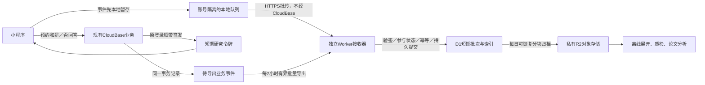

# 独立研究采集服务与当前调用模型

日期：2026-09-22。交付为代码审计、控制台只读观察、架构与实施方案；未开发或部署接收器，未购买服务、修改套餐或开启采集。

> 最新部署约束：用户要求采集基础设施全部使用腾讯云。当前选型以[腾讯云低成本采集方案](tencent-only-collection-plan.md)为准：完整研究采集首选Lighthouse＋同机事务数据库＋COS备份；独立SCF＋COS只是尚缺可靠状态层的低成本比较项。下文的Workers/D1/R2是上一版比较方案，不再作为实施默认；调用审计、身份、幂等、缺失语义及成本模型仍适用。不能将D1事务规则简单换名为COS后宣称具有相同保证。

## 建议与取舍

保留CloudBase的预约、成员权限、行程状态、回访资格与答案；新增客户端研究行为采用**独立HTTPS批量接收器**。先前评估过Cloudflare Workers Paid + D1短期批次存储 + R2归档；在用户新增腾讯云约束后，该托管选择已被上述腾讯云方案替代。本页保留原比较过程，避免丢失调用分析和数据可靠性要求。

同时先修现有业务的重复请求。独立服务只承接新增研究流量，**不会自动降低今天47,700次现有调用**；在低流量下，CloudBase优化后的批量写入可能比另外支付Workers最低月费更便宜。选择独立服务的理由是长期研究存储、离线分析、数据可迁移和成本隔离，不承诺当月总账单必降。

## 已核实与仍未知的用量

控制台为个人版，资源周期显示2026-09-23至2026-10-22；调用本日4.77万次、周期20万次、容量3GB、计算资源15万CU。调用明细默认9月22日且显示暂无数据，日期选择限制资源周期内。本轮没有得到历史7天分类占比或逐函数排名；0/暂无数据不能当作没有使用，单日不能当稳定日均。完整观察见[控制台证据](evidence/cloudbase-usage-observation.md)。

按[官方套餐价格](https://cloud.tencent.com/document/product/876/75213)，若该环境适用0.5元/万次超额单价且启用超限不停服，连续每天47,700次则30天143.1万次，扣20万后调用超额费61.55元。该数是算术情景，不是当前已发生月账单；其他资源另计。不要混用资源点套餐或独立SCF的价格。

## 当前调用模型：请求少不代表数据库工作少

| 场景 | 本地代码推导 | 优先动作 |
| --- | --- | --- |
| 已登录、服务区内、相关缓存全空的首页冷启动 | 页面约5–6次函数请求＋1次直连DB；全局推荐码/登录另计 | 合并共享资料、未读状态；评估读取→状态同步→变化后重读 |
| 同一首页30秒内返回，身份和版本未变 | 可为0次请求 | 保留已有缓存和请求合并，不按停留时间推算调用 |
| 历史行程首次进入 | onLoad/onShow都发请求，通常2次；后端每次按5组历史引用回填 | 优先前端去重；后端按集合合并ID并分页 |
| 携带相同推荐码的冷启动 | launch/show/pageLoad可各trackVisit一次；每次通常约3读2写 | 稳定入站访问ID，前端合并与后端幂等一起做 |
| 拼车列表一次双类型日期页 | 1次函数；两类记录都少于100时通常4次列表/下一日期读取，再加0–2次拉黑查询 | 按action记录内部读取页数；核验索引、fallback及日历缓存 |
| 公共拼车详情 | 缓存先显示仍强制后台重验；本人常用上下车点每次onShow可直读DB | 同一业务版本合并重验，资料共享/按需读；写后强读必须保留 |
| 市场列表 | 5分钟缓存不等于5分钟不发请求；仍后台刷新，还可能补读旧多页缓存的卖家和图片 | 只补即将可见的卖家/图片，保留批查和文件去重 |
| 定时与网站 | 本地仅发现每天一次图片清理；网站已有列表120秒/详情60秒缓存 | 核对线上配置和源站未命中，不能把所有网页访问当CloudBase调用 |

本地审计未发现固定周期轮询或云函数相互嵌套callFunction；主要放大在重复入口、分页与单函数内的数据库工作。线上可能有旧版本或外部调用者，尚未排除。依据与条件见[前端审计](evidence/frontend-call-model.md)、[后端审计](evidence/backend-call-model.md)。这些数量是代码路径，不是计费单位或线上占比。

分别统计函数执行F、客户端直连数据库D、函数内数据库读写Q/W、存储S、研究事件E。先对齐[官方文档数据库计量](https://docs.cloudbase.net/database/faq)与同窗口监控，再映射到账单；不能不经核对直接将F+D+Q+W+S求和。30条事件一次上传，如果后台仍逐条插入30行，数据库工作不会自动变成一次。

## 数据流与最小组件

“每2小时”是首版研究导出时效预算，不是生产任务已经存在。只算定时触发约12次/天、360次/30天；每轮分页、重试、数据库操作和外网流量另外计算。没有积压也会有一次检查，不能称完全零开销。

### 小程序端

- 增加一个共享 `researchCollector` 模块，页面只调用 `track(event)`；模块负责队列、账号隔离、批次和重试。不在每页各建计时器，不影响原业务结果。
- 单批最多50条且总JSON不超过64KiB，先达到哪个就封批。客户端只保存研究伪名、事件、选择集/版本等最小字段，不复制联系方式、姓名或住宅地址。
- 本地沿用500条/256KiB/7天的初始上限，明确丢弃优先级和覆盖缺失。服务端确认持久提交后才删除；离线/退后台不保证必达。
- 独立通道的调用预算可以比CloudBase附带上传更宽松：前台有积压时按大小触发，并可采用60秒最长等待的可配置刷新；没有事件不发请求，后台不定时上传，onHide仅尽力补传。该定时规则只适用于独立接收器，**不恢复CloudBase每20–30秒上报方案**。先按每次访问1–3批测算，不把“恰好一次”当产品保证。
- 研究参与状态和用途版本必须满足原协议。未同意/撤回后不生成待传研究事件；回访答案继续走有权限的业务接口并得到确认。

### 独立接口与存储

| 接口或表 | 具体职责 |
| --- | --- |
| `POST /v1/batches` | 接收客户端事件；校验短期令牌、参与状态、用途/schema版本、大小和限流；不能接受客户端自称业务成功 |
| `POST /v1/business-batches` | 服务端凭据独立鉴权，接收CloudBase成功事实；按eventId去重；客户端令牌无权访问 |
| `POST /v1/participants/state` | 仅可信服务端同步参与/撤回版本；较旧版本不可覆盖撤回；重试幂等 |
| `ingest_batches` | 一批一条不可变载荷，唯一键(subjectId,batchId)，含hash、eventCount、接收时间、客户端时间与版本 |
| `batch_receipts` | 已接收摘要与hash；载荷归档后仍在最大客户端重试期内可返回相同确认，不能仅删除后重新收一份 |
| `research_participants` | 研究伪名、active/revoked、用途版本与单调状态版本；不存openid映射 |
| `archive_manifest` | 对象键、hash、覆盖批次/参与者、状态与删除/归档进度；支持重放和撤回定位 |

使用D1事务/批处理提交载荷与收件摘要，再ACK；不能先返回成功再用后台异步任务赌写入。相同batchId相同hash返回原ACK，相同ID不同内容返回冲突。Client eventId跨批次也须在分析展开时去重，业务成功事实应有独立eventId幂等索引，避免重试膨胀论文样本。保留客户端报告与服务端事实的来源等级。

参与状态/用途版本检查与批次写入必须在同一原子数据库操作或事务内进行条件写入；不能先读active，再无条件插入。撤回增加状态版本，旧版本请求不得在检查与提交的间隙绕过撤回。

现有login只有openid等返回，外部服务不可直接信任。改为原可信登录/认证响应顺带签发研究范围的短期令牌（iss/aud/sub/exp/kid/purposeVersion），Worker按固定算法和预置公钥本地验签；私钥和openid映射只在可信端。登录不一定每次访问执行，首次无有效令牌或过期仍可能需要认证请求，因此不是永久零CloudBase鉴权成本。

参与状态检查由独立库本地完成，不能每批回查CloudBase。撤回先在业务端/客户端停采，可信接口同步接收器阻断状态；只有接收器确认后才报告跨端停止完成，失败保留待同步并可靠重试，不声称仅令牌过期就实现即时撤回。归档与删除任务在提交前复查状态，避免旧任务重新写回已撤回载荷。

### 业务事实与归档

业务成功事件与预约变化在CloudBase同一事务保存outbox。导出器按“未确认＋可领取租约”取有界批次，服务端确认后标记已导出；超时可重新领取。不要只按事件发生时间推进高水位游标，以免遗漏晚提交或晚到事件。投递至少一次，接收端稳定eventId防重。导出失败不改变已成功预约，积压延迟须可见。

D1载荷先保留14天作为工程默认，R2按参与者/日期组成有上限的压缩不可变块，避免所有用户共同追加一个日文件。成功写入并校验R2、提交manifest后才允许按热保留期清理D1载荷；不存在D1与R2跨产品原子提交的假设。首版无需Kafka、Redis、Queue或常驻分析集群。研究分析从归档批量展开，避免每次画图重扫CloudBase业务库。

归档任务领取含参与状态版本的租约并持久登记manifest，撤回后禁止新任务领取；R2 PUT完成后必须再核对参与版本，已撤回或版本不符的对象进入必删队列并实际删除，不能只拒绝提交manifest而留下孤立载荷。清理失败保持pending；报告清理完成前，对在途任务、最大执行窗口及对象清单对账，防止先清理、后到PUT把数据复活。单次“提交前检查”不足以解决这个并发竞态。

研究载荷的最终保留期应在参与说明中确定；工程热保留14天不等于研究总保留14天。撤回清理范围包括热库、归档、分析导出与自管备份，恢复时先重放删除清单。D1付费Time Travel默认保存30天恢复历史，不能承诺删除活动数据即即时抹掉所有历史副本。完整限制见[托管选型核验](evidence/collector-hosting-options.md)。

## 调用、容量与费用情景

以下不是平台实测：每天100/500/2000次访问，每次30条事件、总计50KB；一月30天。纯客户端研究载荷，不包含业务事实、索引、备份、HTTP开销和压缩收益。“访问”不是日活用户。

| 日访问 | 月事件数 | 每访问1批、无重试 | 每访问1–3批＋10%额外重试预算 | 月新增原始载荷 |
| ---: | ---: | ---: | ---: | ---: |
| 100 | 9万 | 3,000请求 | 3,300–9,900请求 | 0.15GB |
| 500 | 45万 | 15,000请求 | 16,500–49,500请求 | 0.75GB |
| 2,000 | 180万 | 60,000请求 | 66,000–198,000请求 | 3GB |

最大情景14天热载荷约1.4GB，按3倍工程空间预留约4.2GB；3倍只是预算，不是收费倍率。每批CPU先假设20ms，最大198,000请求约396万CPU毫秒/月，须压测替换该参数。

[Workers Paid官方价格](https://developers.cloudflare.com/workers/platform/pricing/)最低US$5/月，包含1,000万请求和3,000万CPU毫秒/月。[D1官方价格](https://developers.cloudflare.com/d1/platform/pricing/)包含5GB存储、5,000万写行/月；[R2标准价格](https://developers.cloudflare.com/r2/pricing/)有10GB-month存储与请求免费额度。以上额度按账号共享，域名、其他工作负载、备份与实际超额另算。三种情景可按US$5/月基础费＋实际超额起步预算，不能承诺全包或无限保存。该套餐不是吞吐/延迟保证；独立域名需满足小程序正式版HTTPS请求配置，须做纽约/新泽西真机网络验证。

**CloudBase批量写也是有效备选。** 为防止错误地推销新基础设施，另做敏感性计算：若一批按3–6个计费调用单位估算（仅预算参数，非已核实计费映射），每天500次访问、每次1–3批、10%额外重试，在套餐额度已用完时，新增调用费约2.48–14.85元/月，存储等另算。实际方案仍须测去重/鉴权/事务的成本。由此不能断言独立服务比已有CloudBase批量写便宜。

模型可重跑：[计算脚本](scripts/collection-call-model.mjs)、[结果JSON](evidence/collection-call-scenarios.json)。

## 实施顺序与验收

1. **先修确定重复与加入聚合测量。** 历史页生命周期合并；推荐码稳定访问ID；跨页面本人资料/未读缓存。按function/action/page/trigger/cacheOutcome统计请求，不记录敏感body。服务端同一次执行内累加DB SDK操作数，按抽样/批次汇总，不能新建每请求一次的计数函数。保留身份/权限校验与写后失效。
2. **建立独立服务本地版本。** Worker接口、D1 schema、假令牌/合成事件、幂等ACK、本地账号队列、归档和恢复演练。实现一种目的端；传输适配层可切换，禁止无协调双写计两份样本。
3. **补核心事实与回访。** 先覆盖所有预约变更路径的事务outbox；权限和“是/否/未回答”语义沿用原协议。每2小时导出为起点，按业务事件量和研究时效调整，撤回不等待这一普通归档周期。
4. **小范围试点再扩展。** 先内部真机与合成流量，再按授权参与者启用。观察7天请求、CPU、数据库行读写、空间、重试/丢失、覆盖版本及延迟，再决定是否扩大采集或留在CloudBase批量方案。

工程验收：同批重试不增样本；提交成功后ACK丢失可恢复；切号不串；撤回旧token不再写入；超大事件不堵队列；D1/R2中断不丢已确认数据；恢复不复活已删除数据；采集故障不阻断预约；未再打开用户的缺失不被算成否。费用验收分别报告既有业务与新增研究的增量，不能用总体调用下降掩盖采集缺失。

本轮不承诺“减少80%现有调用”等比例，也没有开启计费、创建云资源或改生产代码。下一步开发代理应依据本方案与[原采集提示词](agent-implementation-prompt.md)交付可审查实现和测量结果，再执行明确授权的上线步骤。
