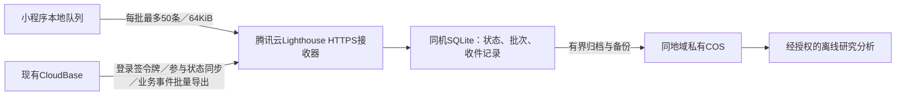

# 全腾讯云的低成本研究采集方案

核验日期：2026-09-22。仅更新选型、估算和实施提示词，未购买、部署或开启采集。此文替代上一版Workers/D1/R2托管选择；当前业务调用审计和研究数据协议继续有效。

> 账号实查更新：已登录腾讯云确认中国大陆企业认证、cloud1个人版、1个月19.90元/6个月119.39元/1年238.78元续费报价。个人版具备备案能力，但当前剩余有效期不足、未开启云托管固定IP；云托管尚未启用，固定IP额外费用未最终确认。见[账号核验记录](evidence/tencent-account-feasibility.md)。无需先升标准版或另买境内服务器，但仍须完成[微信网络接入核验](evidence/weixin-network-requirements.md)。境外机房不自动豁免微信域名ICP备案要求，域名尚未购买或验证。

> 用户选择的活动页已确认：硅谷Linux 2核2GB/20Mbps，288元/年；活动规则明确不支持调整配置，后续扩容按换机迁移规划。加当前CloudBase一年续费报价，基础费用约526.78元/年；域名、备份、超额调用等另计。当前本日业务调用已达5.26万次，新采集服务器不会自动消除这些调用。

## 建议

**完整研究采集首选：一台腾讯云Lighthouse轻量服务器，运行Node.js接收器与同机SQLite事务数据库，普通COS保存备份和批次归档。** 原CloudBase继续处理预约、账号、回访答案和事务outbox。客户端研究批次直接HTTPS上传到新接收器；请求和同机数据库操作不使用CloudBase的20万次调用额度。

选择理由是成本明确、具备参与状态/去重所需的事务能力，且无需另买托管数据库。不是因为独立SCF函数执行昂贵；SCF本身便宜，但SCF＋COS尚缺满足当前协议的可靠状态层。单台服务器需要维护与备份，不提供多机高可用；必须通过实际峰值和故障测试，不能用日均访问量保证性能。

## 价格与选择

以下仅为新增研究基础设施，不包含现有CloudBase账单、域名、证书、额外流量及人工维护。不依赖首购特价或免费试用。

| 方案 | 核验的价格/费用性质 | 当前判断 |
| --- | --- | --- |
| Lighthouse＋同机SQLite＋COS | Linux入门2核2GB/40GB：内地35元/月；海外表30元/月；香港38元/月。COS另计 | 完整采集推荐。海外具体地域和库存须以购买页复核 |
| 独立SCF函数URL＋COS | 没有强制基础月费；中等情景函数执行约0.11–0.34元/月，其他项目另计 | 适合便宜的文件接收；未补可靠状态层前不当完整研究系统 |
| 现有CloudBase攒批＋COS | 无新增服务器月费，仍消耗CloudBase调用并支付相关资源费 | 开发改动较少，但不能隔离当前调用额度 |

依据：[Lighthouse价格总览](https://cloud.tencent.com/document/product/1207/73452)、[SCF取消基础套餐公告](https://cloud.tencent.com/document/product/583/104909)、[独立SCF定价](https://cloud.tencent.com/document/product/583/12281)。旧SCF基础月费规则已于2024-04-01取消，不沿用旧国际站材料；SCF、CloudBase套餐调用、COS请求是不同计费项。

普通COS容量按官方广州计费示例为0.118元/GB/月，标准读写请求0.01元/万次。例如**实际保留10GB**的存储部分约1.18元/月，备份、旧版本和副本都计入实际保留量；这不等于每月新增10GB可以永远只付1.18元。下载到研究者电脑有外网下行费。示例页声明实际价格以购买页为准，不能套作美东报价。[COS计费示例](https://cloud.tencent.com/document/product/436/6241)

Lighthouse方案先以**约35–45元/月新增工程预算**规划小规模试点，包含一台30–35元级服务器及少量COS余量，不是封顶套餐或供应商报价。若需新域名、更多备份、托管SQL或高可用，重新预算。当前主要用户在纽约/新泽西，应优先核对腾讯云美东可售规格与同地域COS，再做真机网络测试；不为差几元默认选远端地域。

## 最小部署结构

1. 一台Linux服务器，HTTPS反向代理＋Node.js服务＋SQLite；数据库只监听本机/文件接口，不向公网开放。首版不需要额外SCF、Redis、Kafka、负载均衡或托管数据库。
2. SQLite保留`research_participants/ingest_batches/batch_receipts/archive_manifest`等逻辑表。使用同机文件、WAL、短写事务、写入串行协调、忙等待和磁盘空间告警；不能把数据库放到COS或网络共享盘。重要提交使用明确的持久化设置。实施时核对实际SQLite版本和官方已修复缺陷。[SQLite WAL](https://www.sqlite.org/wal.html)
3. `POST /v1/batches`本地验证服务端签名研究令牌；检查参与/用途版本与插入批次在同一写事务内完成。相同账号＋batchId＋hash重试返回原结果，不同hash拒绝。客户端事件和可信业务事件分接口、分凭据；不能信任客户端传入的openid。
4. CloudBase已有可信登录顺带签短期令牌；采集服务本地验签和查询参与表，不每批回查CloudBase。首次令牌签发/刷新、参与同步和业务outbox导出仍有CloudBase开销，不能称整个研究零调用。
5. 撤回走高优先级同步并单调增加状态版本；接收器确认阻断后才报告跨系统停采完成。撤回状态和所有接收事务互斥，旧token失效；归档任务领取/提交再次校验版本，清理在途对象，失败留pending。普通业务导出可按每2小时批量执行，撤回不等待该周期。
6. 数据归档采用有界、可按参与者定位的不可变压缩块；最近载荷工程保留14天，收件摘要覆盖最大重试期，研究总保留期另按用途协议。分析读取经授权的批量导出，不反复扫描CloudBase原始库。
7. 使用SQLite在线备份接口或等价一致快照，不能直接复制正在写的`.db`并丢弃WAL。配置轮换、异机COS副本和恢复演练，明确恢复时间及最大可接受数据损失窗口。恢复开放服务前同步最新参与状态、重放删除记录。[SQLite备份](https://www.sqlite.org/backup.html)

**持久性边界：** SQLite提交后ACK能抵御普通进程重启，不自动抵御整盘丢失。若按备份后恢复，最近备份到故障之间的已确认研究批次可能损失，必须明确记录；需要保护每个已确认批次时，采用“本地pending登记→COS保存并校验→本地事务复查参与状态并标记accepted→ACK”，失败和撤回清理孤立对象。不能将一次本地写或每日备份描述成零数据丢失。SQLite与COS间没有跨产品事务，实施代理须覆盖这些故障窗口。

## 为什么没有直接推荐最便宜的SCF＋COS

SCF通过[函数URL](https://cloud.tencent.com/document/product/583/96099)直接接收HTTPS，可绑定[自定义域名](https://cloud.tencent.com/document/product/583/110861)。不必经CloudBase转发，也不应按旧教程新建API网关。其执行费确实低。

假设每天500次访问、每访问1–3批、10%额外重试，共16,500–49,500次/月。按256MiB、平均**计费执行时长200ms**：

| 较高端49,500次/月的费用项 | 模型金额 |
| --- | ---: |
| SCF计算：49,500×0.25GB×0.2秒×0.00011108元 | 0.274923元 |
| SCF调用：4.95万×0.0133元/万次 | 0.065835元 |
| SCF上述两项合计 | 0.340758元 |
| 若每批6次COS标准请求，按广州示例单价 | 0.297元 |
| 若累计实际保留10GB，按广州示例容量单价 | 1.18元 |

200ms是待压测假设，含网络等待，不能拿Workers的CPU毫秒直接代入。表中不包含响应流量、日志、参与状态服务、撤回/归档任务、备份与域名。可由[情景脚本](scripts/collection-call-model.mjs)重算；COS每批6次也是预算输入，不是已实现调用链。

关键限制是COS官方文档说明最终一致性、不支持文件锁。因此“读到尚未撤回→存批次→再读撤回标记”不能证明与授权状态原子提交；仅等待函数最大执行时间也不能证明撤回标记已处处可见。防覆盖上传可以帮助去重，不能同时解决授权、撤回和分析发布的事务问题。[COS一般性问题](https://cloud.tencent.com/document/product/436/30748)

若已有可复用的可靠事务状态服务，SCF路线值得重新比较；若另外开一台服务器仅给SCF提供小数据库，初期直接让这台服务器接收批次更简单。对不关联个人、不需要这套状态合同的汇总日志，可另评估SCF＋COS，但不能据此降低本项目个人研究数据要求。

## 开发顺序和验收

1. 沿用[完整实施提示词](agent-implementation-prompt.md)，先完成本地接收器、SQLite schema、合成事件与客户端队列。先修历史页和推荐码重复请求，保留现有缓存。
2. 固定核心接口与身份/撤回合同，再并行完成回访UI、业务事务outbox和客户端候选观测；不会因换托管厂商扩大采集字段。
3. 交付腾讯云部署清单：地域/规格、HTTPS域名、小程序合法域名、最小权限COS、自动启动、日志轮换、限流、预算/磁盘告警、备份恢复。告警不是费用硬上限。
4. 使用合成数据测试重复/不同hash、ACK丢失、重启、磁盘满、COS中断、并发撤回、归档后迟到PUT、恢复后删除记录生效；使用完整合同判定，不只测“上传成功”。
5. 后续部署后用7天试点核对真实访问、批次数、峰值写事务等待、延迟、失败/重试、备份实际占用及月成本预测，再决定扩容。2核2GB是起步配置，不是未经压测的吞吐保证。

独立接收器只隔离新增研究行为。截图今天47,700次现有CloudBase调用不会因购买服务器自动消失；核心业务仍保留其现有账单。全腾讯云要求落实到新增采集方案，不顺带重构或迁移现有网站。
